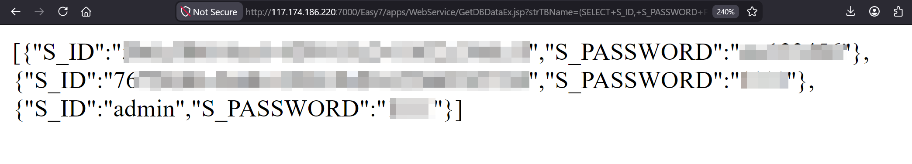

# CVE-2026-9465

- A China Based Company called _`Tiandy Technoilogoies`_, has an active __UnAuthenticated Complete Remote Acess to Database__ vulnerability in its Camera Management Software, namely: Tiandy CMS & Tiandy VMS

- The product pages for both the softwares are:

1. [Tiandy CMS]: [https://en.tiandy.com/server/68714731.html](https://en.tiandy.com/server/68714731.html)

2. [Tiandy VMS]: [https://help.tiandycloud.com/software.html?page=VMS&id=2002](https://help.tiandycloud.com/software.html?page=VMS&id=2002)

- In the Tiandy Easy7 Integrated Management Platform version 7.17.0, which is the latest version, performing manipulation of the URL parameter for a specific endpoint, leads to SQL injection.

- This maps to [CWE-89](https://cwe.mitre.org/data/definitions/89.html)

- This vulnerability has already been reported to the Vendors, but there hasn't been any response from there side.

- There is also an actively released POC, which works as intended.

- a much more detailed report can be accessed through [here](https://ucn9h68n9289.feishu.cn/wiki/MOEfw7m4xiwxifkGWwDcNzEPnD0)

## working POC

- I was able to search through __FOFA__ search engine for the app and see the expoit working for myself

## Doubts

- Should we try to run any POC by ourselfves?
