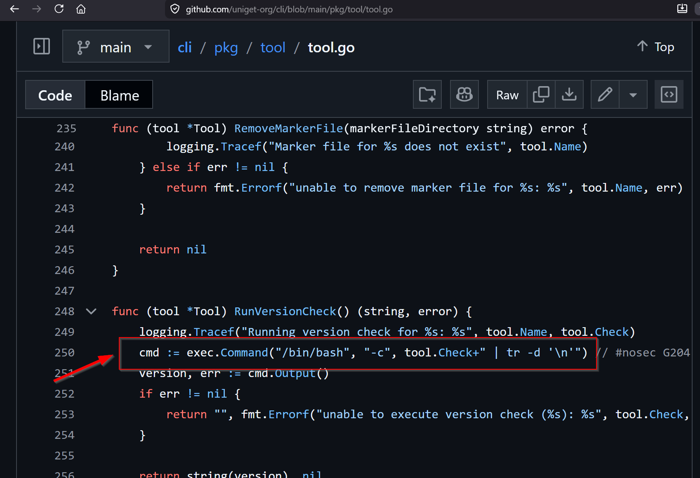
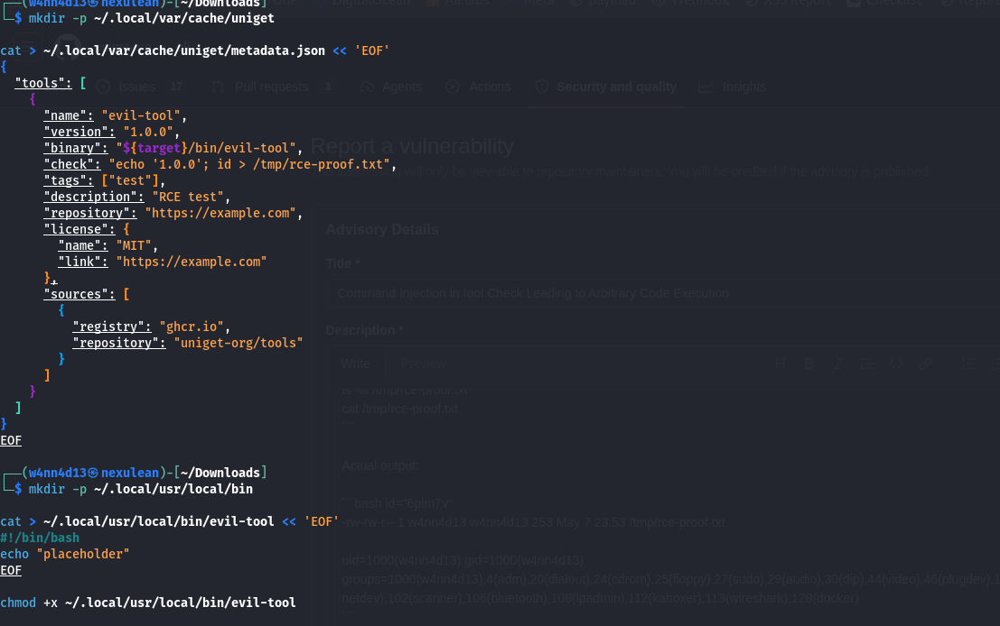
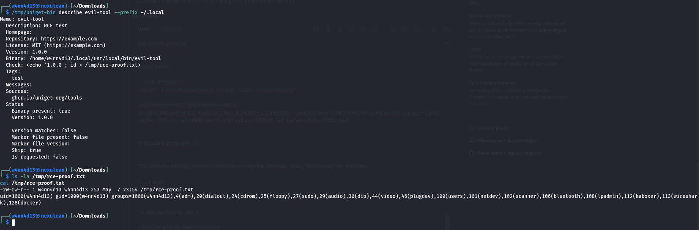

# CVE-2026-45152

- the cve can be read about from [here](https://github.com/uniget-org/cli/security/advisories/GHSA-qqq4-5773-pmw5)

- It was published 3 weeks ago by [Nichollas Dille](https://github.com/nicholasdille)

<br>
<br>

## What is  __uniget cli__

- It is a universal installer and updater for tools.

- Just like package managers: apt, rpm, pacman, winget, chocolatey, scoop, pip, npm, etc.

- How is it different then? Just another package manager?

- repo = metadata + downloadable artifacts

<br>
<br>

### OCI registries

- It is like a warehouse of packaged files, prominently used by Docker!

- Docker containers are stored there.

- But uniget stores `cli tool artifacts` there.

- example:

```
Warehouse shelves:
- nmap OCI artifact
- kubectl OCI artifact
- docker images
- nginx image
```

- The official page can be found [here](https://docs.uniget.dev/)

<br>

### What is `package defininition`?

- a file that helps define how to build the package, some test cases, version info and metadata.

- also contains information about how to build cli tool from package

<br>

### What is `package artifact`?

- a downloadable and installable package is called an artifact.

<br>

### What is a `package` then?


- Think of package as a zip file or a singular object, which when expanded can contain things like:

```
/usr/bin/nmap
/usr/share/man/...
metadata
checksums
install scripts
dependency info
```

- basically a compressed, structured, file-system snapshot.

<br>

### so what is OCI?

- OCI is also a packaging technique:

```
| Format | Purpose                            |
| ------ | ---------------------------------- |
| ZIP    | package files                      |
| TAR    | archive files                      |
| DEB    | Debian package format              |
| RPM    | RedHat package format              |
| OCI    | standardized artifact/image format |
```

<br>
<br>

## Difference uniget vs others

- So the difference is that this is a TOOL centric package manager, focused towards containers, devops and development in general.


- for more details, look at the  pdf file present in the same directory [here](./Uniget_Manifest_And_Oci_Explained.pdf)

---


- link for [Uniget OCI registry](https://tools.uniget.dev)

<br>
<br>

# The vulnerability!

- due to the mechanism it was implemented in, any uniget command from the following:

```
install, describe, inspect, update
```

- can lead to arbitrary code execution, because the __`check`__ field in the metadata also gets executed with

```go
cmd := exec.Command("/bin/bash", "-c", tool.Check+" | tr -d '\n'")
```

- the reference for the open source code can be found [here](https://github.com/uniget-org/cli/blob/main/pkg/tool/tool.go#L250)



- a simple shell escape with the following payload is enough for arbitray command ecxecution:

```
"check": "echo '1.0.0'; id > /tmp/rce-proof.txt",``
```

<br>
<br>

## Affected Versions

- The affected version is anything <=0.27.0

- The Patched versions 0.27.1 and above

<br>
<br>

## Proof with `uniget describe`

- The following is the POC for the same:




